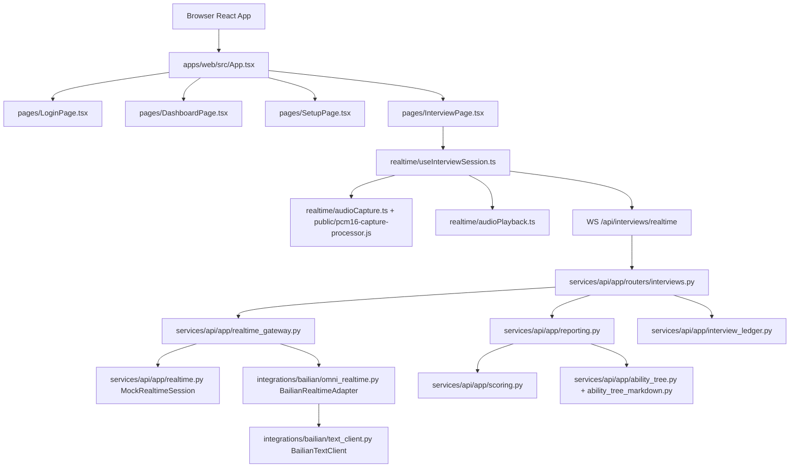
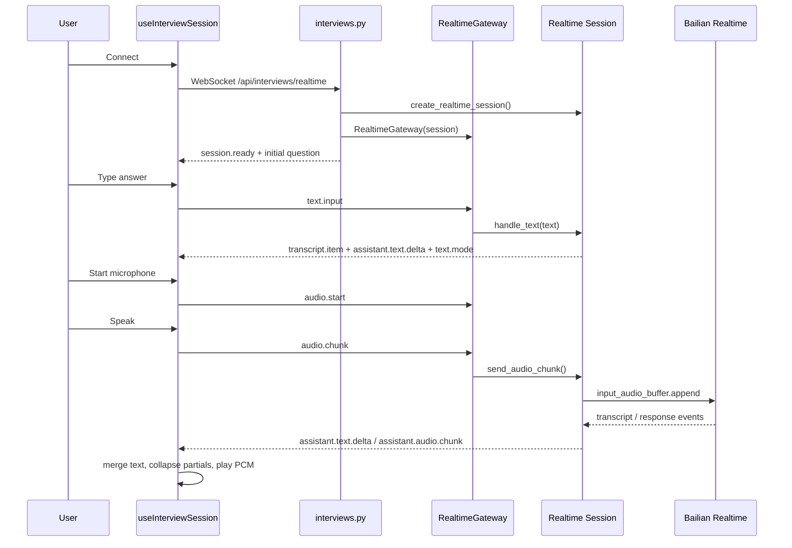

# Virtual Interviewer Codegraph

Updated: 2026-08-17

This is a lightweight manual codegraph. A dedicated `codegraph` skill/tool was not found in the current Codex environment, and the existing Obsidian code map was an older draft. This file records the current code structure so future branches can start from stable entry points instead of rereading the whole repo.

## System Spine



## Frontend Map

| File | Responsibility | Notes |
| --- | --- | --- |
| `apps/web/src/App.tsx` | Top-level screen state and login restore | No router yet; uses local screen enum. |
| `apps/web/src/api/client.ts` | REST API client and auth token helpers | `API_BASE` is fixed to `http://localhost:8000`. |
| `apps/web/src/pages/LoginPage.tsx` | Demo login UI | Calls `login()` from API client. |
| `apps/web/src/pages/DashboardPage.tsx` | Post-login product entry | Routes to setup and ability tree. |
| `apps/web/src/pages/SetupPage.tsx` | Interview setup placeholder | Not yet the backend source of truth for profile/JD/mode. |
| `apps/web/src/pages/InterviewPage.tsx` | Realtime interview UI | Displays event stream and microphone/text controls. |
| `apps/web/src/pages/ReportPage.tsx` | Report display | Loads the saved session transcript and calls report analysis for live sessions. |
| `apps/web/src/pages/AbilityTreePage.tsx` | Ability tree display | Loads JSON nodes and opens the authenticated Markdown index. |
| `apps/web/src/realtime/useInterviewSession.ts` | Browser WebSocket session, event merging, mic start/stop, assistant audio playback | Main frontend realtime hotspot. |
| `apps/web/src/realtime/audioCapture.ts` | Microphone capture wrapper | Uses AudioWorklet and emits 16 kHz PCM chunks. |
| `apps/web/public/pcm16-capture-processor.js` | AudioWorklet processor | Downsamples mic input to PCM16. |
| `apps/web/src/realtime/audioPlayback.ts` | PCM16 assistant audio playback | Decodes base64 PCM and schedules Web Audio chunks. |

## Backend Map

| File | Responsibility | Notes |
| --- | --- | --- |
| `services/api/app/main.py` | FastAPI app factory and router registration | CORS allows local Vite origins. |
| `services/api/app/config.py` | Environment settings | Reads model and mode config from `.env`. |
| `services/api/app/routers/auth.py` | Login/logout/me endpoints | Uses `AuthService`. |
| `services/api/app/auth.py` | Demo auth and bearer token parsing | Lightweight local session model. |
| `services/api/app/routers/profiles.py` | Profile/JD read endpoints | Uses `ProfileLoader`. |
| `services/api/app/profile_loader.py` | Local profile/JD loader | Reads only `data/interview_profiles` and `data/interview_job_descriptions`; the optimization database is isolated. |
| `services/api/app/routers/interviews.py` | Realtime WebSocket and mock report endpoint | Main backend orchestration hotspot. |
| `services/api/app/realtime_gateway.py` | Normalizes browser events to session methods | Dispatches `text.input`, `audio.start`, `audio.chunk`, `audio.stop`, `session.end`. |
| `services/api/app/realtime.py` | Mock realtime session | Offline path and frontend debugging backend. |
| `services/api/app/integrations/bailian/omni_realtime.py` | Qwen-Omni-Realtime WebSocket adapter | Main provider protocol hotspot. |
| `services/api/app/integrations/bailian/text_client.py` | DashScope OpenAI-compatible text client | Used for typed interview replies; should also support model-scored reports. |
| `services/api/app/interviewer_persona.py` | Interviewer prompt and local text interviewer | Controls non-assistant-like behavior. |
| `services/api/app/interview_state.py` | Simple interview state prototype | Used by mock session; not yet a full realtime controller. |
| `services/api/app/tool_router.py` | Function Calling style local tool router | Currently lightweight; can host retrieval/scoring/report tools. |
| `services/api/app/reporting.py` | Report generation and optional model analysis | Uses Bailian structured output with deterministic fallback. |
| `services/api/app/scoring.py` | Deterministic score fallback | Should not be final default scoring path. |
| `services/api/app/ability_tree.py` | Ability tree JSON update | Markdown materialization is handled by `ability_tree_markdown.py`. |
| `services/api/app/ability_tree_markdown.py` | Obsidian-compatible ability tree export | Writes index, skill, evidence, and target notes under ignored runtime data. |
| `services/api/app/interview_ledger.py` | Durable interview evidence ledger | Stores normalized events and complete text while excluding raw audio bytes. |
| `services/api/app/storage.py` | JSON storage helper | Stores session ledgers, reports, and canonical ability trees. |
| `services/api/app/publish.py` | Reserved publication provider types | Do not expand before one deployment path is chosen. |

## Current Realtime Event Flow



## Full-Duplex / Open Model Hotspots

If another branch tries an open-source full-duplex model, start here:

1. `services/api/app/realtime_gateway.py`
   - Keep this browser-facing event contract stable if possible.
   - Add a new session class behind the same methods instead of changing frontend events first.

2. `services/api/app/realtime.py`
   - The mock session shows the minimum method surface: `start_events`, `handle_text`, `handle_audio_start`, `handle_audio_chunk`, `handle_audio_stop`, `handle_session_end`.

3. `services/api/app/integrations/bailian/omni_realtime.py`
   - Use as a provider adapter reference, not as a generic realtime abstraction.
   - Open-source model branch can implement a sibling adapter with the same session method shape.

4. `apps/web/src/realtime/useInterviewSession.ts`
   - Frontend already expects `assistant.text.delta`, `assistant.audio.chunk`, `transcript.partial`, `transcript.item`, and `realtime.error`.
   - Avoid changing this contract until a new backend adapter works.

5. `apps/web/src/realtime/audioCapture.ts`
   - Current input is 16 kHz PCM chunks. If the open-source model wants another sample rate, add conversion at adapter boundary or a clearly named mode.

6. `apps/web/src/realtime/audioPlayback.ts`
   - Current output assumes base64 PCM16 with sample rate from event. Reuse this if the model can emit PCM.

## Known Architecture Gaps

- Realtime events are persisted in a per-session JSON ledger; transactional scaling remains open.
- Report/scoring use optional model assistance with deterministic fallback; per-dimension evidence quotes remain open.
- Current microphone UI is button-style, but Bailian realtime uses server VAD session settings. For stable demo, align this with Manual turn behavior first.
- Setup page choices are not yet wired into backend realtime session creation.
- `relay_realtime_events()` now emits and persists safe provider errors; provider close metadata remains open.
- `BailianTextClient` creates an HTTP client per request; this is acceptable for MVP but not ideal for latency.

## Test Entry Points

Backend:

```powershell
Set-Location -LiteralPath '.\services\api'
.\.venv\Scripts\pytest.exe -q
```

Targeted backend tests:

```powershell
Set-Location -LiteralPath '.\services\api'
.\.venv\Scripts\pytest.exe tests\test_realtime_gateway.py tests\test_bailian_adapter.py tests\test_bailian_text_client.py -q
```

Frontend:

```powershell
Set-Location -LiteralPath '.\apps\web'
npm run test
npm run build
```

Targeted frontend tests:

```powershell
Set-Location -LiteralPath '.\apps\web'
npm run test -- useInterviewSession audioPlayback
```

## Maintenance Rule

Update this file when one of these changes:

- Browser realtime event contract.
- Provider adapter method surface.
- Report/scoring source of truth.
- Ability tree persistence shape.
- Setup/session routing.
- Deployment path.
